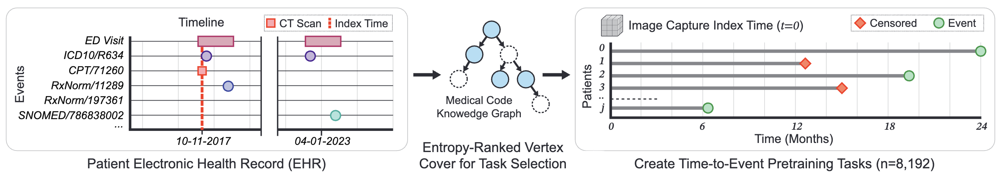
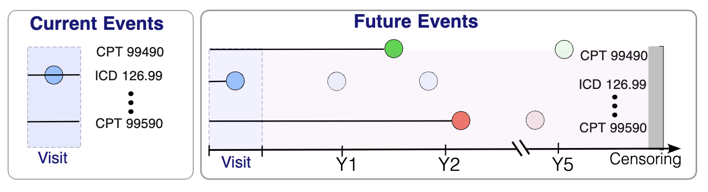
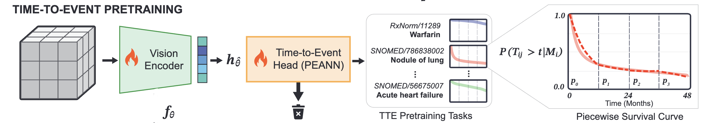
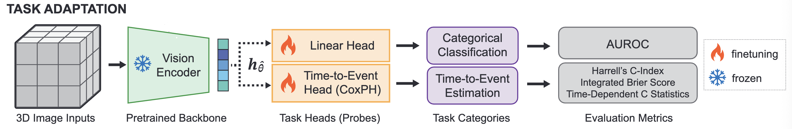

# tte-pretraining
Code for the paper "**Time-to-event pretraining for 3D medical imaging**" (ICLR 2025). You can **[read the paper here](https://arxiv.org/abs/2411.09361)**

We have provided the code for:

- 💿 [Installation](#installation)
- 📥 [Dataset/Model download](#dataset)
- ✍ [Tokenization](#tokenization)
- 🔖 [Labeling](#labeling-for-tte-tasks)
- 🎛 [Pretraining with parallel GPUs](#pretraining)
- ⚖️ [Evaluation with linear probe](#evaluation)
- 📚 [Tutorial for deriving TTE training loss](#tutorial)
- 🔬 [Unit Test](#unit-test)


## Installation

You should install the required packages first

```bash
conda create -n TTE_ENV python=3.10 -y
conda activate TTE_ENV
pip install -e .
```


Additionally, for our data preprocessing pipeline we use **[FEMR  (Framework for Electronic Medical Records)](https://github.com/som-shahlab/femr)**, a Python package for building deep learning models with EHR data. 

You must also have CUDA/cuDNN installed (we recommend CUDA 11.8 and cuDNN 8.7.0). 

Note that this currently only works on Linux machines.

```bash
pip install --upgrade "jax[cuda11_pip]==0.4.8" -f https://storage.googleapis.com/jax-releases/jax_cuda_releases.html
git clone https://github.com/som-shahlab/femr.git
cd femr
pip install -e .
git switch -c femrv2_pub --track origin/femrv2_pub
```


## Dataset

You should direct to [here](https://aimi.stanford.edu/datasets/inspect-Multimodal-Dataset-for-Pulmonary-Embolism-Diagnosis-and-Prognosis) to download the **image modality data** in NIfTI format (i.e. file extensions as `.nii.gz`)
- The path to this folder will be used as `nii_folder` in below commands

You should direct to [here](https://redivis.com/datasets/dzc6-9jyt6gapt) to download **EHR modality data** in [MEDS format](https://github.com/Medical-Event-Data-Standard) (filename `meds_omop_inspect.tar.gz`)
- The path to this folder be be used as `parquet_folder` in below commands

You should direct to [here](https://huggingface.co/collections/StanfordShahLab/image-models-6810740bb92a97ce61406bac) to download the **model weights** from Huggingface


## Tokenization

The tokenization process is to organize the EHR code into hierarchical form based on their ontology and then rank them based on entropy and other processing (e.g. normalizing given counts of patients with the code). Then eventually save the tokenizer



The number of pretraining tasks we select is 8,192 and the vocabulary size (total unique codes from EHR) is 65,535. You will need to download ontology from Athena. 

Athena is an OHDSI service for downloading ontologies. Simply visit https://athena.ohdsi.org, create an account, and click download at the top and put the ontology in the path in bash file.

Note: the downloaded ontology can be too large (i.e. few hundred GB) so optionally you want to prune it to fit to our dataset to make running substantially faster:

```bash
cd tte-pretraining/src/tte_pretraining/training
python 1a_prune_ontology.py \
--input-dataset "inspect/timelines_smallfiles_meds/data/*parquet" \
--input-ontology "inspect/ontology.pkl" \
--output-ontology "inspect/inspect_ontology.pkl" \
--num-processors 32 
```

After that you can start training a tokenizer and save it:

```bash
./1a_tokenizer.sh
```

## Labeling for TTE tasks
We also provide code examples for deriving the TTE labels of downstream tasks, i.e. a format of a tuple (`time_to_event_of_interest (in sec), is_censored`). In the paper we labeled 5 such tasks: ATX (Atelectasis), CMG (Cardiomegaly), CONS (Consolidation), EDM (Edema), and PEFF (Pleural Effusion). However the users can specify their own labeling criteria to do TTE labeling. 



Note that our EHR data is under [OHDSI common data model](https://www.ohdsi.org/data-standardization/) so our codes are mainly under [SNOMED schema](https://www.snomed.org/). E.g. these are the codes that we used for labeling:

| Task     | Code |
|----------|----------|
| Pulmonary Hypertension    | SNOMED/70995007  |
| Pulmonary Embolism        | SNOMED/59282003  |
| Atelectasis               | SNOMED/46621007   |
| Cardiomegaly              | SNOMED/8186001   |
| Consolidation             | SNOMED/95436008   |
| Edema                     | SNOMED/267038008 |
| Pleural Effusion          | SNOMED/60046008 |

You can then proceed to start deriving the TTE labels

```bash
cd tte-pretraining/src/tte_pretraining/labeling
labeling_functions='tte_mortality' # or 'tte_Pleural_Effusion' etc.

python generate_tte_labels.py \
--index_time_csv_path 'metadata_20250303.csv' \
--index_time_column 'procedure_DATETIME' \
--path_to_database 'femr_extract' \
--path_to_output_dir 'output' \
--labeling_function $labeling_function \
--is_skip_featurize \
--num_threads 12
```


## Pretraining

For pretraining we used 3 model architectures (SWINUNETR/ResNet/DenseNet)
- SWINUNETR's pretrianing weights is from training on 50k public available CT/MRI dataset (weights can be download from [here to load in torch](https://github.com/Project-MONAI/MONAI-extra-test-data/releases/download/0.8.1/model_swinvit.pt))
- ResNet and DenseNet are initialized from inflating 2D weights of pretrained data of ImageNet. The inflation process can be followed by [this instructions](https://github.com/hassony2/inflated_convnets_pytorch)
    - The script to conduct the operations are `tte-pretraining/src/tte_pretraining/training/src/i3dense.py`
    - And `tte-pretraining/src/tte_pretraining/training/src/i3res.py`



You can should specify the pretrained tokenizer from above and the dataset path (the `parquet` file folder) and image data path (`.nii.gz` files folder)

There are other hyperparameter training for the three architecture, you should refer to the [hyperparameter table](https://arxiv.org/pdf/2411.09361#page=21.10) for detailed reference when you input them into the bash script

```bash
cd ttte-pretraining/src/tte_pretraining/training/
./1_pretrain_TTE_H100run_ddp.sh
```

Each of the architecture would require different training clocktime (or GPU time) with rough estimate.

| Architecture              | Number of GPUs        | Estimated wall-clock time | Estimated GPU hours |
|---------------------------|------------------------|----------------------------|----------------------|
| SwinUNETR<sub>base/TTE</sub>     | 4 H100 (80GB)           | 15 days                    | 1,440 GPU hours      |
| DenseNet-121<sub>base/TTE</sub>  | 4 A100 (40GB)           | 9 days                     | 864 GPU hours        |
| ResNet-152<sub>base/TTE</sub>    | 4 A100 (80GB)           | 10 days                    | 960 GPU hours        |


Note: optionally you can perform per task fine-tuning but this process is generally expensive given you need to train to completion for any downstream, i.e. `num_model * num_tasks` for full paremeter update and this tends not work well (per our [fine-tuning table results](https://arxiv.org/pdf/2411.09361#page=23.10)) but we also provide you script to to do fine-tuning as example

```bash
cd tte-pretraining/src/tte_pretraining/training/
./2_finetune_A100run_ddp.sh
```


## Evaluation

After pretraining is done we will perform linear probe (logistic regressin on binary classification tasks, and CoX-PH head of DeepSurv for TTE tasks).



```bash
cd tte-pretraining/src/tte_pretraining/training
./3_inference_TTE_H100_ddp.sh
```

We also test on the [RSPECT data](https://www.kaggle.com/c/rsna-str-pulmonary-embolism-detection/data) for the out-of-distribution diagnosis task only evaluation

```bash
cd tte-pretraining/src/tte_pretraining/training
./3_inference_TTE_RSNA.sh
```


## Tutorial

We also provide guide for deriving tte training loss with exemplar CTs and their corresponding future codes as TTE tasks.

Please refer to notebook at `tutorial/pretrain_TTE_tutorial.ipynb`

Note: 
- This notebook doesn't require GPU to run but just CPU so the speed will slower but it only uses 1 CT as an example
- It still requires all the needed `nii_folder`, `parquet_folder`, `ontology_path` to derive TTE loss
- We reduced the `vocab_size` to 512 and `num_tasks` to 200 to improve speed of getting results
- The tutorial will prefit a bias term of the piecewise exponential model layer to avoid collapse without a good initial fit. This will take a few moments
- There's no gradient update or backpropagation, as we are only demonstrating deriving the loss term

## Unit Test

We also provide unit test for our model loading, deriving featuring, etc. as preliminary guardrails

Please refer to folder at `tte-pretraining/tests`

Note: 
- we mainly provide guardrails for out-of-the-box inference and adaptation
- It loads a model weight (you need to download from above Huggingface repo https://huggingface.co/StanfordShahLab)
- Then user needs to supply labels so that the embeddings can eventually be mapped to it
- It trains a logistic regression given frozen model, and eval
- It tests if the features/labels/embedding match as expected, e.g. the TTE pretrained DenseNet is trained with 1024 dim as feature for downstream linear probe

## 🎓 Citation

If you found this work useful, please consider citing it:

```
@article{huo2024time,
      @article{huo2024time,
      title={Time-to-Event Pretraining for 3D Medical Imaging},
      author={Huo, Zepeng and Fries, Jason Alan and Lozano, Alejandro and Valanarasu, Jeya Maria Jose and Steinberg, Ethan and Blankemeier, Louis and Chaudhari, Akshay S and Langlotz, Curtis and Shah, Nigam H},
      journal={arXiv preprint arXiv:2411.09361},
      year={2024}
      url={https://arxiv.org/abs/2411.09361}, 
}
```
